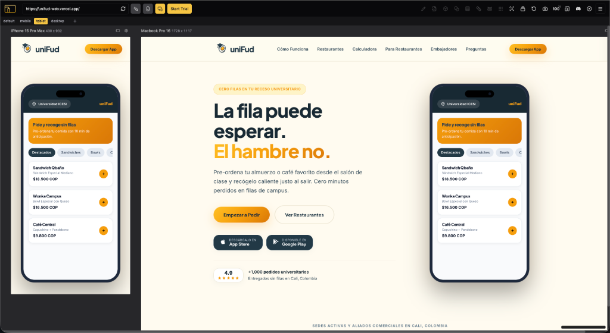
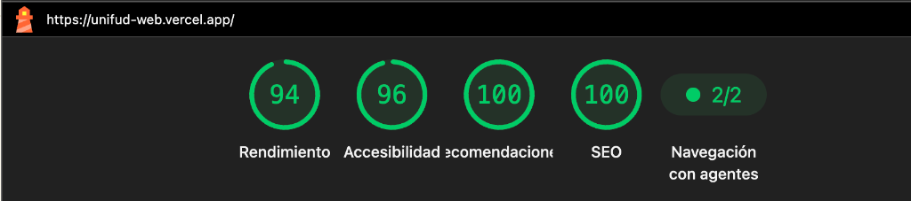

<div align="center">
  
  <h1>uniFud Web Platform</h1>
  <p><strong>Plataforma tecnologica de pre-ordenes y comida express para campus universitarios.</strong></p>
  <p><em>La fila puede esperar. El hambre no.</em></p>
  <br />
</div>

<div align="center">
  
</div>

---

## Descargo de Responsabilidad y Proposito Educativo

> **Aviso de Caracter Educativo y No Comercial:**
> Este repositorio y proyecto web corresponden a una propuesta de rediseno conceptual, academica y de investigacion tecnica sobre arquitectura frontend moderna, optimizacion de rendimiento (Astro 5+, TypeScript) y experiencia de usuario (UI/UX) para aplicaciones de campus universitarios.
>
> Este desarrollo **no tiene fines de comercializacion ni lucro independiente**. Todos los nombres comerciales, marcas registradas, marcas de comida y logotipos mostrados (como uniFud, Sandwich Qbano, Wonka Campus, Universidades) pertenecen exclusivamente a sus respectivos propietarios legales y se utilizan unicamente como referencia visual y contextual en el marco del estudio de diseno y arquitectura de software.

---

## Descripcion General

**uniFud** es una startup foodtech con base en Cali, Colombia, disenada para erradicar las filas en horas pico dentro de universidades e instituciones educativas. Permite a los estudiantes pre-ordenar alimentos y bebidas desde sus aulas y recogerlos listos en barra en segundos, con alertas automaticas y pagos directos.

Esta plataforma web esta construida con **Astro 5+**, implementando una arquitectura modular por islas orientada a maxima velocidad de carga (0kb de JavaScript innecesario en cliente), SEO local por campus universitario y escalabilidad hacia pedidos web (PWA).

---

## Caracteristicas Principales

- **Identidad Visual Oficial**: Paleta corporativa con fondo crema (`#FEFBF0`), azul petroleo (`#223846`), acentos en ambar (`#F59E0B`), tipografia Plus Jakarta Sans e Inter, y cero emojis.
- **Simulador Interactivo de Smartphone**: Render de dispositivo movil con experiencia en vivo de seleccion de sedes, carta de productos y alerta de pedidos.
- **Catalogo Dinamico por Campus**: Soporte para multiples sedes (Universidad ICESI, Pontificia Universidad Javeriana Cali, Lago Verde).
- **Calculadora de Tiempo Ahorrado**: Widget interactivo para calcular horas semestrales recuperadas por el estudiante.
- **Modulo B2B para Restaurantes Aliados**: Simulador comercial de incremento de capacidad (+35% en horas pico) y formulario de postulacion para concesiones de campus.
- **Programa uniFud Reps**: Pagina dedicada para captacion de embajadores y lideres estudiantiles.
- **Documentacion Legal Completa**:
  - `terminos-y-condiciones.astro`: Terminos y Condiciones de Uso v1.0 - Colombia.
  - `politica-privacidad.astro`: Politica de Tratamiento de Datos Personales (Ley 1581 de 2012 / Habeas Data).
  - `solicitud-de-borrado.astro`: Procedimiento formal para eliminacion de cuenta y datos.

---

## Auditoria de Rendimiento y Calidad (Lighthouse)

Desplegado y verificado en produccion en [unifud-web.vercel.app](https://unifud-web.vercel.app/):

<div align="center">
  
</div>

### Metricas Clave de Rendimiento y Accesibilidad

| Dimension | Puntuacion | Detalle de Optimizacion |
| :--- | :---: | :--- |
| **Rendimiento** | **94 / 100** | Carga de fuentes no bloqueante, FCP/LCP < 1.9s, CLS = 0, TBT = 0ms |
| **Accesibilidad** | **96 / 100** | Cumplimiento estricto WCAG AA, contraste 4.5:1+, roles ARIA y labels |
| **Recomendaciones** | **100 / 100** | Estandares web modernos, HTTPS seguro y buenas practicas de seguridad |
| **SEO** | **100 / 100** | Schema.org JSON-LD estructurado, Open Graph, Geo Tags Cali y Sitemap XML |
| **Navegacion con Agentes** | **2 / 2** | Estructura semantica accesible para indexadores y navegacion asistida |

---

## Arquitectura del Proyecto

```text
unifud-web/
├── public/
│   ├── logo.svg              # Logotipo vectorial oficial
│   ├── logo.png              # Asset en alta resolucion para Open Graph
│   ├── favicon.svg           # Icono de pestana SVG
│   ├── favicon.ico           # Favicon universal
│   ├── preview-devices.png   # Captura responsive en dispositivos reales
│   ├── lighthouse-score.png  # Evidencia de auditoria Lighthouse
│   ├── robots.txt            # Directivas de rastreo para motores de busqueda
│   └── sitemap.xml           # Indice de rutas estaticas para indexacion
├── src/
│   ├── components/           # Componentes modulares de interfaz
│   │   ├── Navbar.astro
│   │   ├── Hero.astro
│   │   ├── CampusTicker.astro
│   │   ├── ProblemSolution.astro
│   │   ├── TimeCalculator.astro
│   │   ├── CampusRestaurants.astro
│   │   ├── B2BSection.astro
│   │   ├── RepsProgram.astro
│   │   ├── FAQ.astro
│   │   ├── Modals.astro
│   │   └── Footer.astro
│   ├── layouts/
│   │   └── Layout.astro      # Layout base con metadatos, Open Graph, Geo tags y JSON-LD
│   ├── data/
│   │   └── campusData.ts     # Datos tipados en TypeScript de sedes y menus
│   ├── styles/
│   │   ├── tokens.css        # Tokens de color (#FEFBF0, #223846), sombras y tipografia
│   │   └── global.css        # Estilos globales y utilidades
│   └── pages/
│       ├── index.astro                 # Landing page principal
│       ├── aliados.astro               # Landing para concesiones y restaurantes
│       ├── reps.astro                  # Programa de embajadores universitarios
│       ├── terminos-y-condiciones.astro# Terminos y condiciones legales
│       ├── politica-privacidad.astro   # Politica de privacidad y datos
│       └── solicitud-de-borrado.astro  # Solicitud de eliminacion de cuenta
├── astro.config.mjs
└── package.json
```

---

## Instalacion y Uso Local

### Requisitos Previos
- Node.js version 18+ o superior
- npm version 9+ o superior

### Pasos

1. Clonar el repositorio:
```bash
git clone https://github.com/luisrodriguez-rgb/Unifud-Web.git
cd Unifud-Web
```

2. Instalar dependencias:
```bash
npm install
```

3. Iniciar el servidor de desarrollo en vivo:
```bash
npm run dev
```
La aplicacion estara disponible en `http://localhost:4321`.

4. Compilar para produccion (HTML estatico ultrarrapido):
```bash
npm run build
```

5. Previsualizar el bundle de produccion:
```bash
npm run preview
```

---

## Informacion Corporativa de Referencia

- **Razon Social de Referencia**: UNIFUD S.A.S.
- **NIT**: 901968882-2
- **Domicilio**: Cali, Valle del Cauca, Colombia
- **Contacto Administrativo Oficial**: administracion@unifudapp.com
- **Canal Habeas Data**: atencionalclienteunifud@gmail.com
- **Instagram Oficial**: [@unifud.co](https://instagram.com/unifud.co)

---

## Licencia y Derechos

Proyecto desarrollado bajo licencia MIT / Uso Académico Demostrativo. Todos los derechos sobre marcas y nombres comerciales corresponden a sus respectivos titulares.
